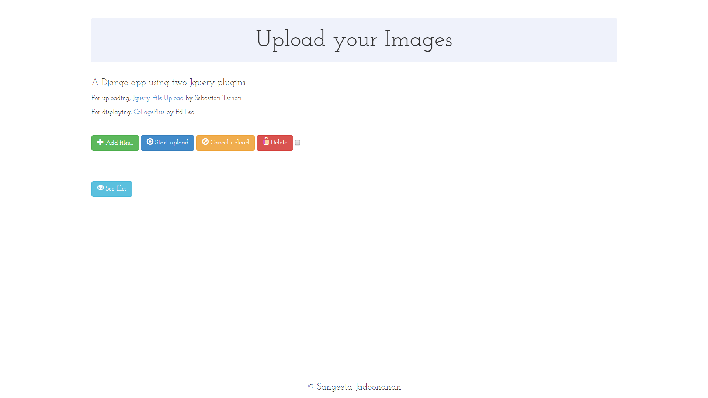
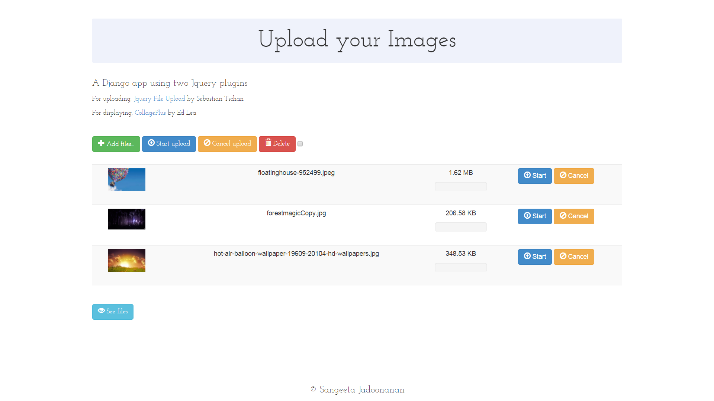
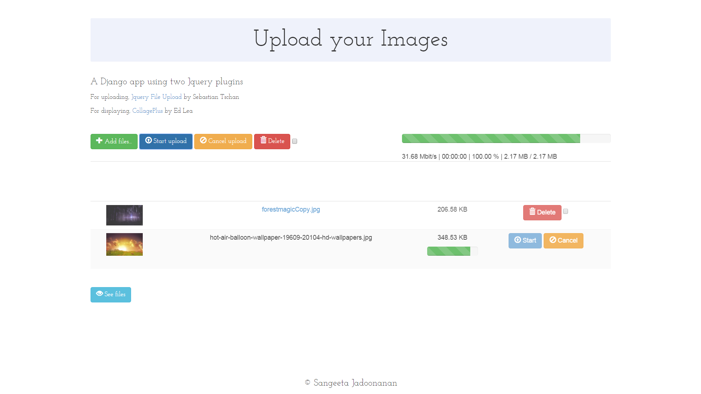
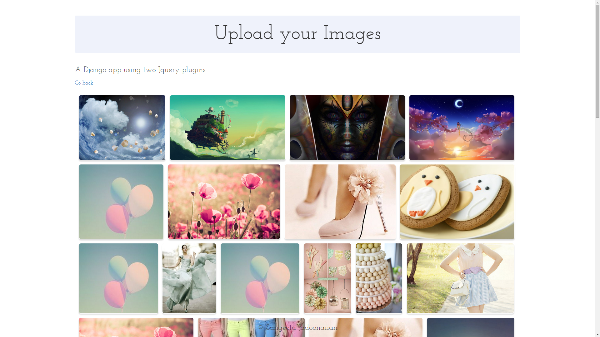

Django-Jquery-Photo-App
=======================

### A Django app that allows user to upload pictures and view them. 

######Django Photo App that uses Sebastian Tschan's (blueimp) [Jquery File Upload Plugin](https://blueimp.github.io/jQuery-File-Upload/) for the interface for uploading files and Ed Lea's [CollagePlus Jquery Plugin](http://ed-lea.github.io/jquery-collagePlus/) for a nice display finish.

###Some screenshots:

######Upload/Home Page

######Files Chosen (but not yet uploaded)

######Uploading the files

######Viewing all uploaded files

######Most recently uploaded are last pictures

