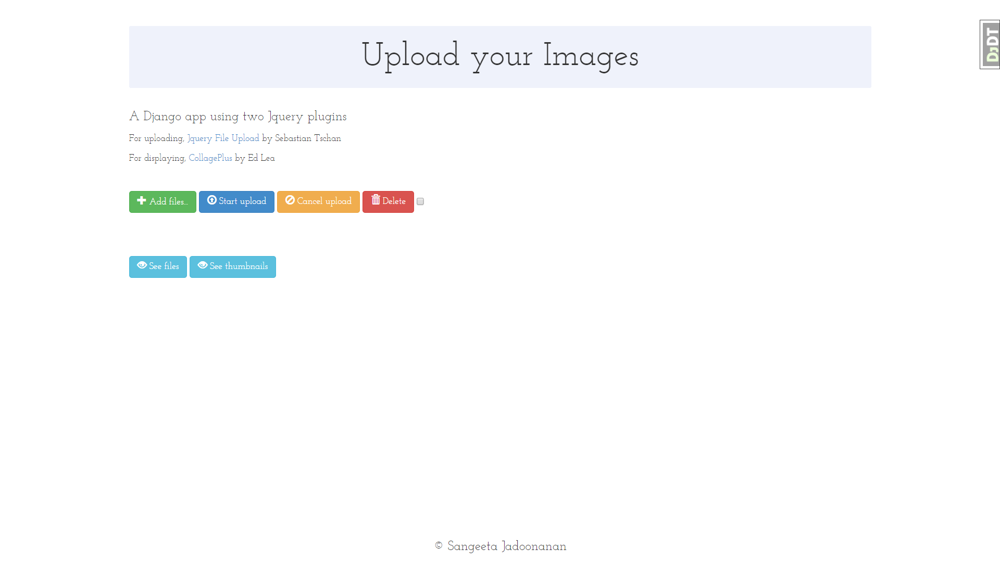
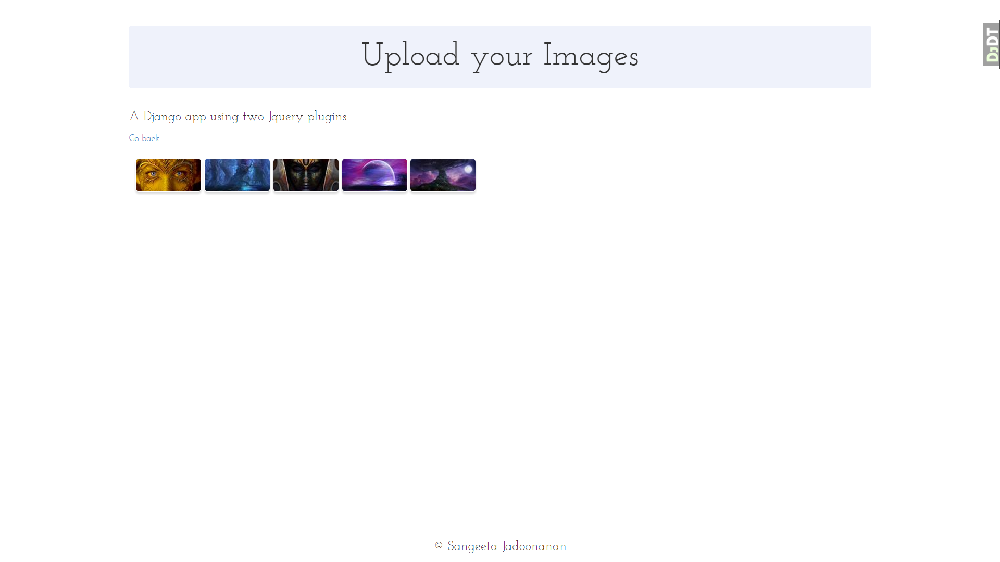

Django-Jquery-Photo-App
=======================

### A Django app that allows user to upload pictures and view them. 

######Django Photo App that uses 
* Sebastian Tschan's (blueimp) [Jquery File Upload Plugin](https://blueimp.github.io/jQuery-File-Upload/) for the interface for uploading files,
* Ed Lea's [CollagePlus Jquery Plugin](http://ed-lea.github.io/jquery-collagePlus/) for a nice display finish,
* and [Django-imagekit](https://github.com/matthewwithanm/django-imagekit) to create thumbnails from uploaded images.

###Some screenshots:

######Upload/Home Page

######Viewing all uploaded files

######Viewing all thumbnails

